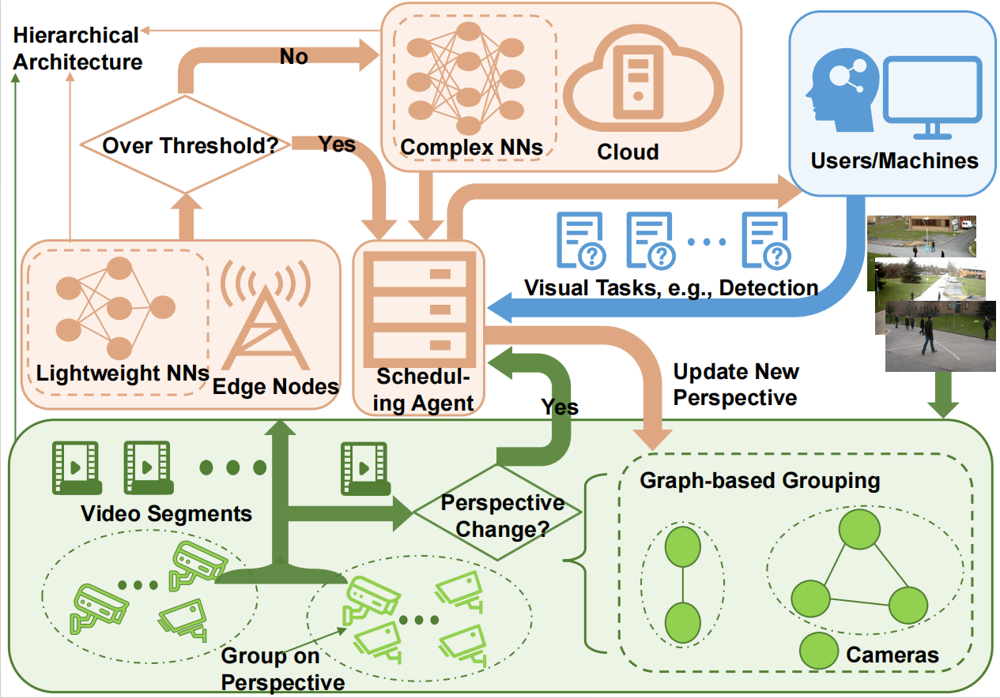

# AxiomVision: Accuracy-Guaranteed Adaptive Visual Model Selection for Perspective-Aware Video Analytics

This repository contains the source code for reproducing the results of our paper titled [**AxiomVision: Accuracy-Guaranteed Adaptive Visual Model Selection for Perspective-Aware Video Analytics**](https://arxiv.org/abs/2407.20124), which is accepted by ACM MM 2024.



AxiomVision is a general online streaming framework that adaptively selects the most effective visual model based on the end-edge-cloud architecture to ensure the accuracy of video stream analysis in diverse scenarios.

## 🔧Prerequisites

(If you're only interested in the plotting part, please ignore this section.)

**If you want to run based on your dataset**

To get started, ensure that you can run multiple target detection models (such as [YOLOv5](https://github.com/ultralytics/yolov5), [SSD](https://github.com/lufficc/SSD), etc.) or other computer vision tasks, and importantly, modify their source code to ensure that the output TXT detection results have the same format.

For example, in the output TXT file of YOLOv5, if confidence is included, the format is as follows: the first column is the class label, the second is the normalized center x-coordinate, the third is the normalized center y-coordinate, the fourth is the normalized width, the fifth is the normalized height, and the sixth is the confidence score.  In contrast, [mmdetection](https://github.com/open-mmlab/mmdetection)'s format outputs a JSON file for each image frame. This JSON file contains a dictionary with three keys: labels, scores, and bounding boxes. The values of boxes are the coordinates before normalization and sequentially represent the x and y coordinates of the top-left corner, followed by the x and y coordinates of the bottom-right corner.

We modified the source code of these programs to standardize the output file format by altering the way the results are saved. 


We also used the [Paddle](https://github.com/PaddlePaddle/PaddleSeg) segmentation model and created an environment named "Paddle" You only need to prepare this setup if you want to test segmentation tasks.

## 📚 Dataset: 
We searched for online traffic cameras on YouTube and found four different views monitoring the same intersection. We saved scenes from various environments, including daytime, dusk, night, and snowy conditions.


|  Source  | Type    | URL                                                         |
|---------|---------|-------------------------------------------------------------|
| Youtube | Videos | https://www.youtube.com/watch?v=1EiC9bvVGnk |
| Youtube | Videos | https://www.youtube.com/watch?v=FmoclK_hKz8 |
| Youtube | Videos | https://www.youtube.com/watch?v=BN7gzH-i-zo |
| Youtube | Videos | https://www.youtube.com/watch?v=Zj0pXlq2-jI |
| Github | Videos | https://github.com/sjtu-medialab/Free-Viewpoint-RGB-D-Video-Dataset |
| CADC  Dataset |   Videos  | http://cadcd.uwaterloo.ca/ |
| COCO Dataset | Images  | http://images.cocodataset.org/zips/train2017.zip |


## 👉 Code Structure

```
.
├── README.md
├── Motivation
│   ├── Base
│   │   ├── video.py
│   │   └── performance.py
│   ├── data
│   │   ├── figure1_data.npy
│   │   ├── ...
│   │   └── figure6_data_segmentation.npy
│   ├── figure4_src_img
│   │   ├── light1.jpg
│   │   ├── ...
│   │   └── light4.jpg
│   ├── figure5_src_img
│   │   ├── perspective_1.jpg
│   │   ├── ...
│   │   └── perspective_4.jpg
│   ├── motivation_config.json
│   ├── motivation_dataprocess.py
│   └── motivation_plot.py
└── Experiment
    ├── Algorithm
    │   ├── Axiomvision.py
    │   ├── wo_Group.py
    │   ├── ... (different algorithms)
    │   ├── Greedy.py
    │   ├── paras.py
    │   ├── experiment_config.json
    │   ├── performance.py
    │   ├── video.py
    │   ├── Base.py
    │   └── Enviroment.py
    ├── retrained_models
    │   ├── coco5k_Significantly_Darker_100
    │   ├── ...
    │   └── coco5k_Extremely_Bright_100
    ├── main.py
    ├── experiment_prepare_config.json
    ├── experiment_dataprocess.py
    ├── demo.py (This is an example of modifying different model's source code to analyze both time and accuracy together.)
    └── svd_decomposition.py

```

## 🚀How to Run

Execute the following command to reproduce the figures in the paper:

####  Motivation:

1. Set up your environment
2. Prepare your dataset (if needed)
3. Run `motivation_plot.py` (activate the function you want to run)
4. Run `motivation_dataprocess.py` (activate the function you want to run)


####  Experiment:

1. Run `experiment_dataprocess.py` (activate the function you want to run)
2. Run `svd_decomposition.py`
3. Run `main.py` (activate the function you want to run)

To compare various algorithms, please consider three dimensions: algorithm_time, average_payoff, and dnn_time.

For details on obtaining inference time, please refer to `demo.py`. The algorithm time can be recorded by writing to a txt file within the activation function.

## 🌟 Citation

If you find this work helpful to your research, please kindly consider citing our paper.

```
@inproceedings{dai2024axiomvision,
  title={AxiomVision: Accuracy-Guaranteed Adaptive Visual Model Selection for Perspective-Aware Video Analytics},
  author={Dai, Xiangxiang and Zhang, Zeyu and Yang, Peng and Xu, Yuedong and Liu, Xutong and Lui, John CS},
  booktitle={Proceedings of the 32nd ACM International Conference on Multimedia},
  pages={7229--7238},
  year={2024}
}
```